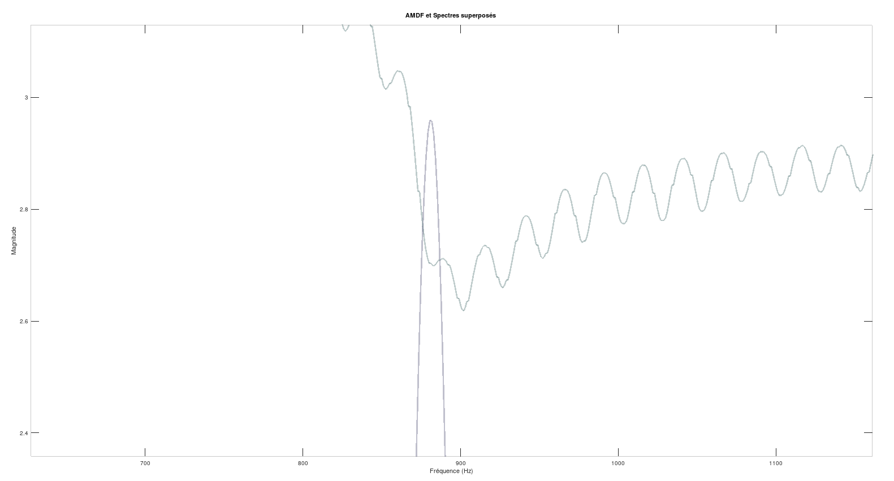
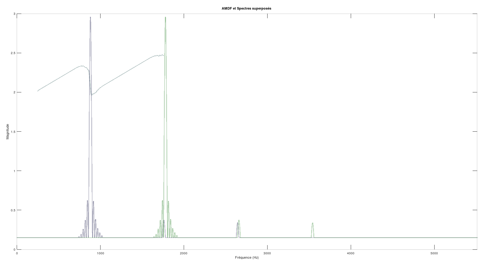

# Convertisseur MP3 vers MIDI

Ce projet de groupe, réalisé en 2023 pour un cours de traitement du signal, convertit un fichier MP3 en MIDI via un traitement du signal en MATLAB, un formatage en C et une interface graphique Python.

## Fichiers Principaux

### `main.m` (MATLAB)

- **Rôle** : Lit `harry.wav`, applique un filtre passe-bas, décime le signal (facteur 4), divise en trames de 20 ms, et utilise l'AMDF pour détecter le pitch (247 Hz–1760 Hz). Sortie : `resultat.txt` (pitch MIDI, volume 1–99, durée).
- **Particularités** : Utilise une fenêtre Blackman et un seuil pour réduire le bruit.

### `converter.c`

- **Rôle** : Formate `resultat.txt` en `resultat2.txt` en convertissant le pitch en entier et en ajustant le volume.

### `main.py`

- **Rôle** : Interface graphique (`tkinter`) pour sélectionner `resultat2.txt`, générer un fichier MIDI via `midiutil` (120 BPM, 1 beat d'écart entre notes).

### Fichiers Associés

- **Entrée** : `harry.wav`.
- **Sorties** : `resultat.txt`, `resultat2.txt`, fichier MIDI (ex. `output.mid`).

## Défis du Traitement du Signal

- **Précision du pitch** : L'AMDF souffre d'oscillations dues au bruit, atténuées par un seuil et une fenêtre Blackman, mais des erreurs de conversion fréquence-points persistent.
- **Segmentation des notes** : Les trames fixes (20 ms) fragmentent les notes, et l'absence de détection robuste des silences limite la reconnaissance à un seul instrument.

## Exécution

1. Exécuter `main.m` pour générer `resultat.txt`.
2. Compiler/exécuter `converter.c` pour créer `resultat2.txt`.
3. Lancer `main.py`, sélectionner `resultat2.txt`, choisir un chemin de sortie MIDI, et générer.

Extrait de notre soutenance :

PRINCIPE : L'AMDF (AVERAGE MAGNITUDE DIFFERENCE FUNCTION) :

$$
FP*{AMDF,l}(\tau) = \frac{1}{\text{Norme}} \sum*{k=0}^{M-1} |s_l(k) - s_l(k + \tau)|
$$

FIGURE 1 : PROBLÈME DE CONVERSION DE FRÉQUENCE EN POINTS POUR LE DÉCALAGE DU SPECTRE.

FIGURE 2 : PROBLÈME D’OSCILLATIONS DE L’AMDF (AU DESSUS) À CAUSE DU BRUIT SUR LE SPECTRE.

FIGURE3:LÉGER DÉCALAGE DU MINIMUM DE L’AMDF

Figure 4 : AJOUT D’UN SEUIL, L’AMDF EST BEAUCOUP PLUS LISSE.
